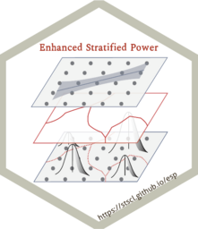

<!-- README.md is generated from README.Rmd. Please edit that file -->

# esp <a href="https://ausgis.github.io/esp/"></a>

<!-- badges: start -->

[](https://lifecycle.r-lib.org/articles/stages.html#experimental)
[](https://CRAN.R-project.org/package=esp)
<!-- badges: end -->

**Enhanced Stratified Power**

## Installation

- Install from [CRAN](https://CRAN.R-project.org/package=esp) with:

``` r
install.packages("esp")
```

- Install development binary version from
  [R-universe](https://ausgis.r-universe.dev/esp) with:

``` r
install.packages('esp',
                 repos = c("https://ausgis.r-universe.dev",
                           "https://cloud.r-project.org"),
                 dep = TRUE)
```

- Install development source version from
  [GitHub](https://github.com/ausgis/esp) with:

``` r
# install.packages("devtools")
devtools::install_github("ausgis/esp",
                         build_vignettes = TRUE,
                         dep = TRUE)
```
