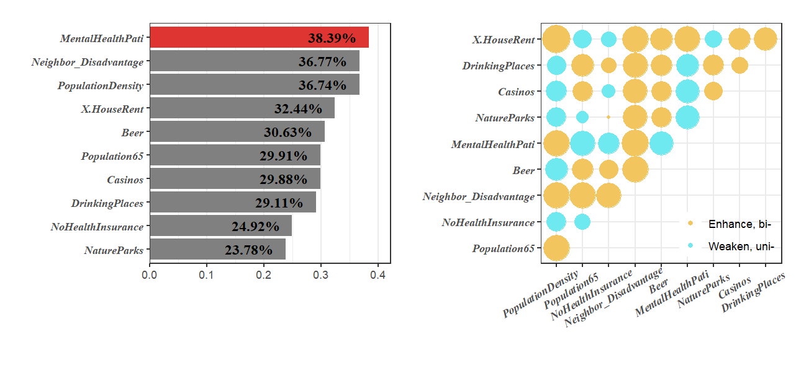
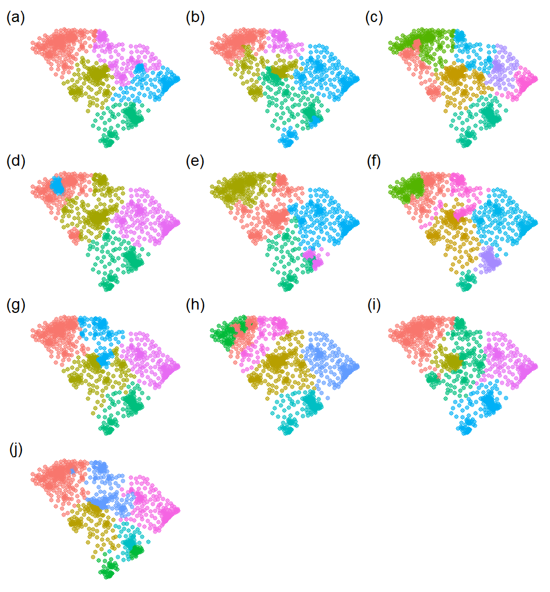
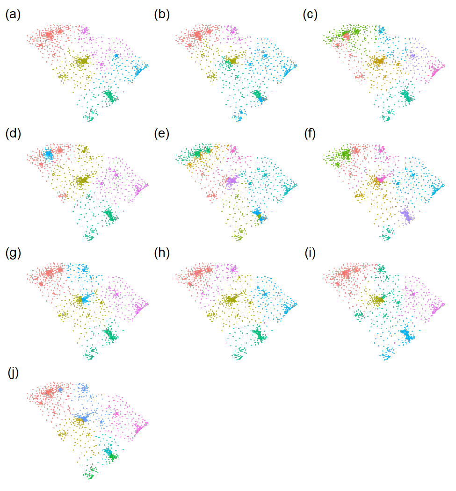
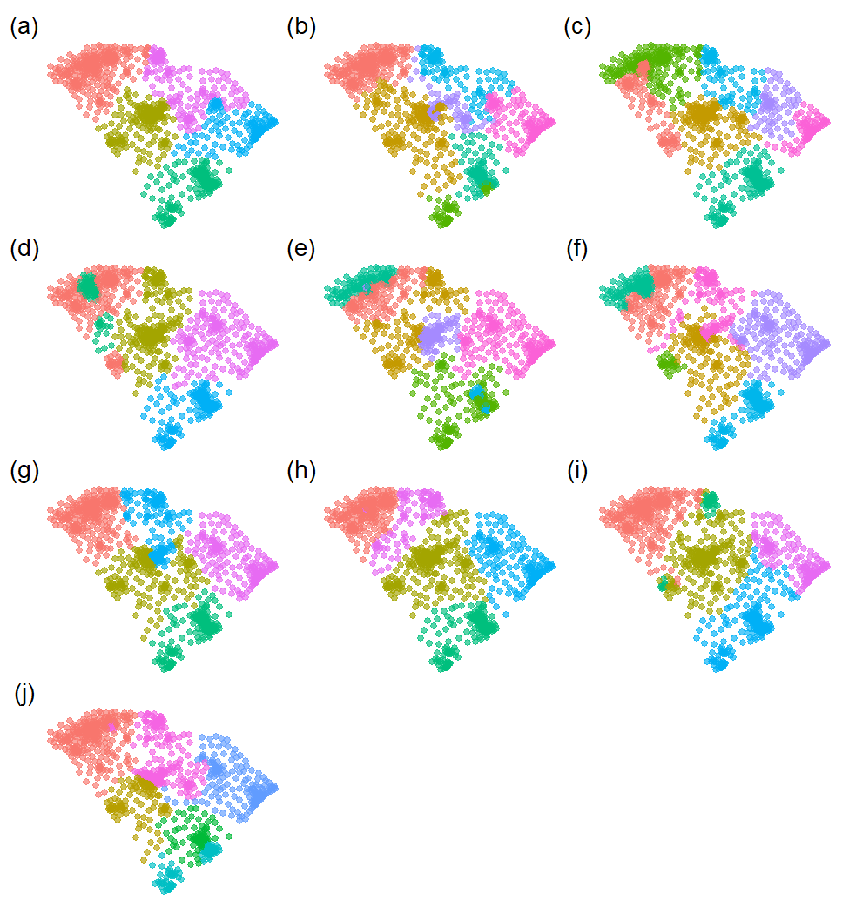
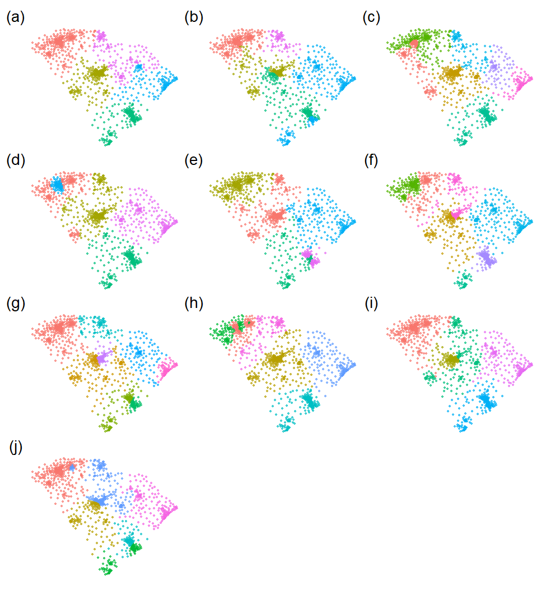
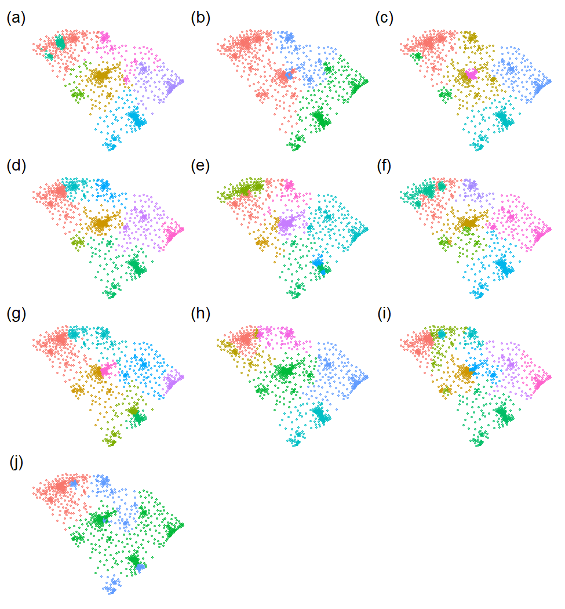

### Install and load R packages

```r
install.packages(c("sf","gdverse"), dep = T)
# install.packages("devtools")
devtools::install_github("stscl/sesp",build_vignettes = TRUE,dep = TRUE)
```


``` r
library(sf)
## Linking to GEOS 3.12.1, GDAL 3.8.4, PROJ 9.3.1; sf_use_s2() is TRUE
library(sesp)
library(gdverse)
```

Using the same data as [the gdverse idsa vignette](https://stscl.github.io/gdverse/articles/idsa.html):


``` r
depression = system.file('extdata/Depression.csv',package = 'gdverse') |>
  readr::read_csv() |>
  sf::st_as_sf(coords = c('X','Y'), crs = 4326)
## Rows: 1072 Columns: 13
## ── Column specification ────────────────────────────────────────────────────────────────────────────
## Delimiter: ","
## dbl (13): X, Y, Depression_prevelence, PopulationDensity, Population65, NoHealthInsurance, Neigh...
## 
## ℹ Use `spec()` to retrieve the full column specification for this data.
## ℹ Specify the column types or set `show_col_types = FALSE` to quiet this message.
depression
## Simple feature collection with 1072 features and 11 fields
## Geometry type: POINT
## Dimension:     XY
## Bounding box:  xmin: -83.1795 ymin: 32.11464 xmax: -78.6023 ymax: 35.17354
## Geodetic CRS:  WGS 84
## # A tibble: 1,072 × 12
##    Depression_prevelence PopulationDensity Population65 NoHealthInsurance Neighbor_Disadvantage
##  *                 <dbl>             <dbl>        <dbl>             <dbl>                 <dbl>
##  1                  23.1              61.5         22.5              7.98               -0.0525
##  2                  22.8              58.3         16.8             11.0                -0.254 
##  3                  23.2              35.9         24.5              9.31               -0.0540
##  4                  21.8              76.1         21.8             13.2                 0.0731
##  5                  20.7              47.3         22.0             11                   0.763 
##  6                  21.3              32.5         19.2             13.0                 0.422 
##  7                  22                36.9         19.2             10.8                 0.113 
##  8                  21.2              61.5         15.9              8.57               -0.154 
##  9                  22.7              67.2         15.7             17.8                -0.320 
## 10                  20.6             254.          11.3             12.7                 0.457 
## # ℹ 1,062 more rows
## # ℹ 7 more variables: Beer <dbl>, MentalHealthPati <dbl>, NatureParks <dbl>, Casinos <dbl>,
## #   DrinkingPlaces <dbl>, X.HouseRent <dbl>, geometry <POINT [°]>
```

### SESP With Linear Regression


``` r
system.time({
  g1 = sesp(Depression_prevelence ~ ., data = depression,
            model = 'ols', overlay = 'intersection', cores = 8)
})
##    user  system elapsed 
##    4.79    0.78   29.21
g1
## ***          Spatially Explicit Stratified Power     
## 
##  Q values are estimated using *Ordinary Least Square* 
## 
##  -------------- Global Power of Determinant : ------------
## Variable              Qvalue AIC      BIC      LogLik    
## Neighbor_Disadvantage 0.296  4370.901 4400.765 -2179.450 
## MentalHealthPati      0.260  4428.205 4468.023 -2206.103 
## NoHealthInsurance     0.255  4435.513 4475.331 -2209.756 
## X.HouseRent           0.225  4476.344 4511.185 -2231.172 
## Casinos               0.205  4503.507 4538.348 -2244.754 
## DrinkingPlaces        0.203  4503.855 4533.718 -2245.927 
## PopulationDensity     0.202  4505.365 4535.229 -2246.682 
## Beer                  0.200  4507.758 4537.622 -2247.879 
## NatureParks           0.181  4533.589 4563.453 -2260.794 
## Population65          0.159  4561.304 4591.168 -2274.652 
## 
##  -------------  Global Variable Interaction : ------------
## Variable                                    Interaction  
## PopulationDensity ∩ Population65          Enhance, bi- 
## PopulationDensity ∩ NoHealthInsurance     Enhance, bi- 
## PopulationDensity ∩ Neighbor_Disadvantage Enhance, bi- 
## PopulationDensity ∩ Beer                  Enhance, bi- 
## PopulationDensity ∩ MentalHealthPati      Enhance, bi- 
## PopulationDensity ∩ NatureParks           Enhance, bi- 
## PopulationDensity ∩ Casinos               Enhance, bi- 
## PopulationDensity ∩ DrinkingPlaces        Enhance, bi- 
## PopulationDensity ∩ X.HouseRent           Enhance, bi- 
## Population65 ∩ NoHealthInsurance          Enhance, bi- 
## 
## ! Only the top ten items of global scale are displayed.
## ! The others can be accessed through specific subsets.
plot(g1,slicenum = 10) +
  ggplot2::theme(axis.text.x = ggplot2::element_text(
                                  angle = 30,vjust = 0.85,hjust = 0.75)
                )
```


### SESP With Spatial Lag Regression


``` r
system.time({
  g2 = sesp(Depression_prevelence ~ .,
            data = depression,
            model = 'lag', cores = 8)
})
##    user  system elapsed 
##    5.67    0.44  244.28
g2
## ***          Spatially Explicit Stratified Power     
## 
##  Q values are estimated using *Spatial Lag Model* 
## 
##  -------------- Global Power of Determinant : ------------
## Variable              Qvalue AIC      BIC      LogLik    
## Neighbor_Disadvantage 0.289  4248.866 4283.707 -2117.433 
## MentalHealthPati      0.240  4288.518 4333.313 -2135.259 
## NoHealthInsurance     0.216  4267.870 4312.665 -2124.935 
## X.HouseRent           0.187  4316.759 4356.578 -2150.380 
## Beer                  0.187  4319.936 4369.709 -2149.968 
## DrinkingPlaces        0.160  4330.763 4365.604 -2158.382 
## PopulationDensity     0.154  4333.170 4368.011 -2159.585 
## Casinos               0.153  4346.299 4381.139 -2166.149 
## NatureParks           0.138  4364.690 4399.531 -2175.345 
## Population65          0.122  4370.485 4405.326 -2178.242 
## 
##  -------------  Global Variable Interaction : ------------
## Variable                                    Interaction  
## PopulationDensity ∩ Population65          Enhance, bi- 
## PopulationDensity ∩ NoHealthInsurance     Enhance, bi- 
## PopulationDensity ∩ Neighbor_Disadvantage Enhance, bi- 
## PopulationDensity ∩ Beer                  Enhance, bi- 
## PopulationDensity ∩ MentalHealthPati      Weaken, uni- 
## PopulationDensity ∩ NatureParks           Weaken, uni- 
## PopulationDensity ∩ Casinos               Enhance, bi- 
## PopulationDensity ∩ DrinkingPlaces        Weaken, uni- 
## PopulationDensity ∩ X.HouseRent           Enhance, bi- 
## Population65 ∩ NoHealthInsurance          Weaken, uni- 
## 
## ! Only the top ten items of global scale are displayed.
## ! The others can be accessed through specific subsets.
plot(g2,slicenum = 10) +
  ggplot2::theme(axis.text.x = ggplot2::element_text(
                                  angle = 30,vjust = 0.85,hjust = 0.75)
                )
```


### SESP With Spatial Error Regression


``` r
system.time({
  g3 = sesp(Depression_prevelence ~ .,
            data = depression,
            model = 'error', cores = 8)
})
##    user  system elapsed 
##    8.09    0.75  132.50
g3
## ***          Spatially Explicit Stratified Power     
## 
##  Q values are estimated using *Spatial Error Model* 
## 
##  -------------- Global Power of Determinant : ------------
## Variable              Qvalue AIC      BIC      LogLik    
## Neighbor_Disadvantage 0.289  4238.682 4273.523 -2112.341 
## NoHealthInsurance     0.253  4230.432 4275.227 -2106.216 
## MentalHealthPati      0.247  4262.110 4306.905 -2122.055 
## X.HouseRent           0.219  4279.959 4319.777 -2131.979 
## PopulationDensity     0.199  4288.640 4323.481 -2137.320 
## DrinkingPlaces        0.198  4295.621 4330.462 -2140.811 
## Beer                  0.193  4292.395 4327.236 -2139.197 
## Casinos               0.184  4305.020 4339.861 -2145.510 
## NatureParks           0.171  4325.679 4360.520 -2155.839 
## Population65          0.156  4335.830 4370.671 -2160.915 
## 
##  -------------  Global Variable Interaction : ------------
## Variable                                    Interaction  
## PopulationDensity ∩ Population65          Weaken, uni- 
## PopulationDensity ∩ NoHealthInsurance     Enhance, bi- 
## PopulationDensity ∩ Neighbor_Disadvantage Enhance, bi- 
## PopulationDensity ∩ Beer                  Enhance, bi- 
## PopulationDensity ∩ MentalHealthPati      Enhance, bi- 
## PopulationDensity ∩ NatureParks           Weaken, uni- 
## PopulationDensity ∩ Casinos               Enhance, bi- 
## PopulationDensity ∩ DrinkingPlaces        Enhance, bi- 
## PopulationDensity ∩ X.HouseRent           Enhance, bi- 
## Population65 ∩ NoHealthInsurance          Weaken, uni- 
## 
## ! Only the top ten items of global scale are displayed.
## ! The others can be accessed through specific subsets.
plot(g3,slicenum = 10) +
  ggplot2::theme(axis.text.x = ggplot2::element_text(
                                  angle = 30,vjust = 0.85,hjust = 0.75)
                )
```


### SESP With Spatial Durbin Regression


``` r
system.time({
  g4 = sesp(Depression_prevelence ~ ., data = depression,
            model = 'lag', durbin = TRUE, cores = 8)
})
##    user  system elapsed 
##    8.86    0.92  243.60
g4
## ***          Spatially Explicit Stratified Power     
## 
##  Q values are estimated using *Spatial Durbin Model* 
## 
##  -------------- Global Power of Determinant : ------------
## Variable              Qvalue AIC      BIC      LogLik    
## Neighbor_Disadvantage 0.316  4226.864 4281.614 -2102.432 
## MentalHealthPati      0.296  4247.222 4321.882 -2108.611 
## NoHealthInsurance     0.261  4238.839 4313.499 -2104.420 
## NatureParks           0.252  4285.895 4370.509 -2125.948 
## X.HouseRent           0.239  4280.458 4345.163 -2127.229 
## Casinos               0.237  4291.052 4355.756 -2132.526 
## PopulationDensity     0.211  4291.372 4346.122 -2134.686 
## DrinkingPlaces        0.210  4294.833 4349.584 -2136.417 
## Beer                  0.209  4291.057 4345.807 -2134.529 
## Population65          0.163  4340.250 4395.001 -2159.125 
## 
##  -------------  Global Variable Interaction : ------------
## Variable                                    Interaction  
## PopulationDensity ∩ Population65          Enhance, bi- 
## PopulationDensity ∩ NoHealthInsurance     Enhance, bi- 
## PopulationDensity ∩ Neighbor_Disadvantage Enhance, bi- 
## PopulationDensity ∩ Beer                  Enhance, bi- 
## PopulationDensity ∩ MentalHealthPati      Enhance, bi- 
## PopulationDensity ∩ NatureParks           Enhance, bi- 
## PopulationDensity ∩ Casinos               Enhance, bi- 
## PopulationDensity ∩ DrinkingPlaces        Enhance, bi- 
## PopulationDensity ∩ X.HouseRent           Enhance, bi- 
## Population65 ∩ NoHealthInsurance          Enhance, bi- 
## 
## ! Only the top ten items of global scale are displayed.
## ! The others can be accessed through specific subsets.
plot(g4,slicenum = 10) +
  ggplot2::theme(axis.text.x = ggplot2::element_text(
                                  angle = 30,vjust = 0.85,hjust = 0.75)
                )
```


### SESP With Spatial Autoregressive Combined


``` r
system.time({
  g5 = sesp(Depression_prevelence ~ .,
            data = depression,
            model = 'sac', cores = 8)
})
##    user  system elapsed 
##   10.25    1.53  661.03
g5
## ***          Spatially Explicit Stratified Power     
## 
##  Q values are estimated using *Spatial Autoregressive Combined* 
## 
##  -------------- Global Power of Determinant : ------------
## Variable              Qvalue AIC      BIC      LogLik    
## Neighbor_Disadvantage 0.269  4237.927 4277.746 -2110.964 
## NoHealthInsurance     0.241  4215.178 4264.950 -2097.589 
## MentalHealthPati      0.230  4245.335 4295.108 -2112.667 
## X.HouseRent           0.214  4255.934 4300.730 -2118.967 
## PopulationDensity     0.197  4263.110 4302.928 -2123.555 
## DrinkingPlaces        0.191  4274.134 4313.952 -2129.067 
## Beer                  0.191  4266.667 4306.485 -2125.334 
## Casinos               0.190  4276.229 4321.025 -2129.115 
## NatureParks           0.175  4300.239 4340.058 -2142.120 
## Population65          0.156  4310.872 4350.690 -2147.436 
## 
##  -------------  Global Variable Interaction : ------------
## Variable                                    Interaction  
## PopulationDensity ∩ Population65          Weaken, uni- 
## PopulationDensity ∩ NoHealthInsurance     Enhance, bi- 
## PopulationDensity ∩ Neighbor_Disadvantage Enhance, bi- 
## PopulationDensity ∩ Beer                  Enhance, bi- 
## PopulationDensity ∩ MentalHealthPati      Enhance, bi- 
## PopulationDensity ∩ NatureParks           Weaken, uni- 
## PopulationDensity ∩ Casinos               Enhance, bi- 
## PopulationDensity ∩ DrinkingPlaces        Enhance, bi- 
## PopulationDensity ∩ X.HouseRent           Enhance, bi- 
## Population65 ∩ NoHealthInsurance          Weaken, uni- 
## 
## ! Only the top ten items of global scale are displayed.
## ! The others can be accessed through specific subsets.
plot(g5,slicenum = 10) +
  ggplot2::theme(axis.text.x = ggplot2::element_text(
                                  angle = 30,vjust = 0.85,hjust = 0.75)
                )
```


### SESP With Geographically Weighted Regression


``` r
system.time({
  g6 = sesp(Depression_prevelence ~ .,
            data = depression,
            model = 'gwr', cores = 8)
})
##    user  system elapsed 
##    8.51    1.11  147.69
g6
## ***          Spatially Explicit Stratified Power     
## 
##  Q values are estimated using *Geographically Weighted Regression* 
## 
##  -------------- Global Power of Determinant : ------------
## Variable              Qvalue AIC      
## X.HouseRent           0.370  4255.989 
## MentalHealthPati      0.367  4258.876 
## PopulationDensity     0.366  4260.457 
## Neighbor_Disadvantage 0.354  4277.147 
## Beer                  0.350  4288.285 
## Population65          0.317  4337.745 
## Casinos               0.307  4354.933 
## DrinkingPlaces        0.294  4373.148 
## NatureParks           0.266  4412.671 
## NoHealthInsurance     0.254  4429.183 
## 
##  -------------  Global Variable Interaction : ------------
## Variable                                    Interaction  
## PopulationDensity ∩ Population65          Enhance, bi- 
## PopulationDensity ∩ NoHealthInsurance     Enhance, bi- 
## PopulationDensity ∩ Neighbor_Disadvantage Enhance, bi- 
## PopulationDensity ∩ Beer                  Enhance, bi- 
## PopulationDensity ∩ MentalHealthPati      Enhance, bi- 
## PopulationDensity ∩ NatureParks           Weaken, uni- 
## PopulationDensity ∩ Casinos               Weaken, uni- 
## PopulationDensity ∩ DrinkingPlaces        Weaken, uni- 
## PopulationDensity ∩ X.HouseRent           Enhance, bi- 
## Population65 ∩ NoHealthInsurance          Weaken, uni- 
## 
## ! Only the top ten items of global scale are displayed.
## ! The others can be accessed through specific subsets.
plot(g6,slicenum = 10) +
  ggplot2::theme(axis.text.x = ggplot2::element_text(
                                  angle = 30,vjust = 0.85,hjust = 0.75)
                )
```



### Results of optimal spatial discretization


``` r
plot_optdisc = \(g){
 gmap = sf::st_set_geometry(g$optdisc,sf::st_geometry(depression))

 fig1 = seq_along(g$optdisc) |>
   purrr::map(\(.x) ggplot2::ggplot(data = gmap) +
                ggplot2::geom_sf(ggplot2::aes(color = factor(g$optdisc[,.x,drop = TRUE])),
                                 alpha = .65, size = 0.5) +
                ggplot2::labs(color = 'zones') +
                ggplot2::theme_void() +
                ggplot2::theme(
                  legend.position = "none")
                ) %>%
   patchwork::wrap_plots(ncol = 3, byrow = TRUE) +
   patchwork::plot_annotation(
     tag_levels = 'a',
     tag_prefix = '(',
     tag_suffix = ')',
     tag_sep = '',
     theme = ggplot2::theme(plot.tag = ggplot2::element_text(family = "serif"),
                            plot.tag.position = "topleft"))
 return(fig1)
}
```


``` r
plot_optdisc(g1)
```




``` r
plot_optdisc(g2)
```




``` r
plot_optdisc(g3)
```




``` r
plot_optdisc(g4)
```




``` r
plot_optdisc(g5)
```




``` r
plot_optdisc(g6)
```


