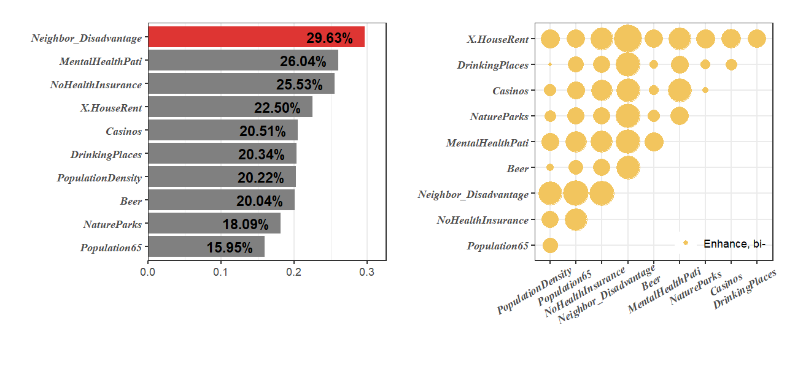
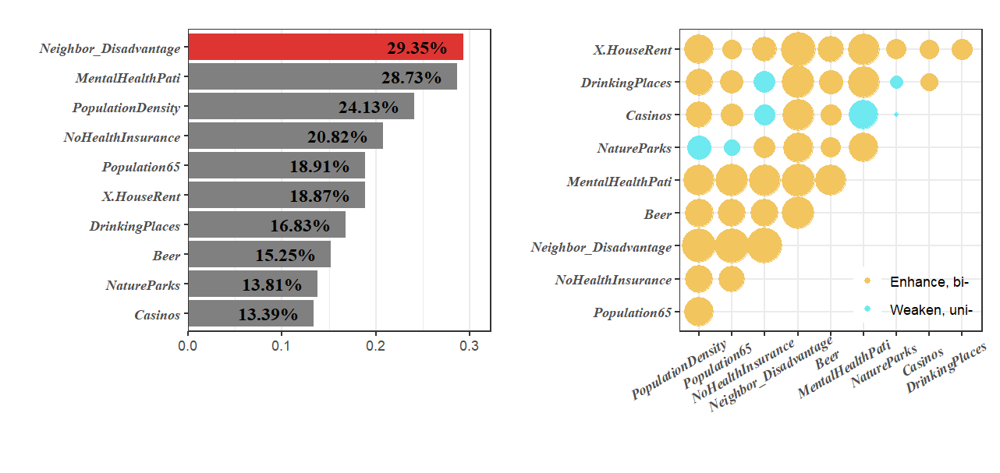
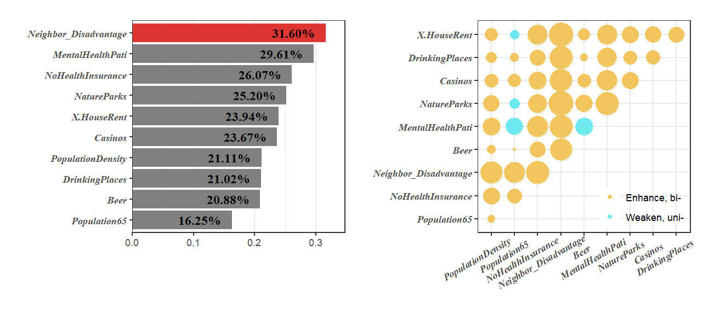
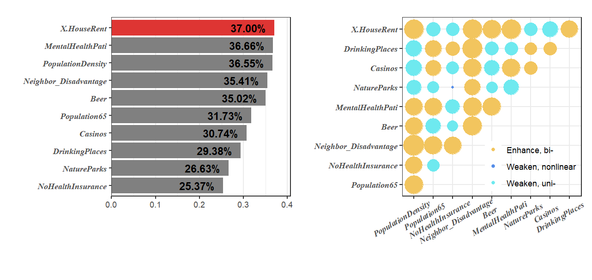

### Install and load R packages

```r
install.packages(c("sf","gdverse"), dep = T)
# install.packages("devtools")
devtools::install_github("stscl/sesp",build_vignettes = TRUE,dep = TRUE)
```


``` r
library(sf)
## Linking to GEOS 3.12.1, GDAL 3.8.4, PROJ 9.3.1; sf_use_s2() is TRUE
library(sesp)
library(gdverse)
```

Using the same data as [the gdverse idsa vignette](https://stscl.github.io/gdverse/articles/idsa.html):


``` r
depression = system.file('extdata/Depression.csv',package = 'gdverse') |>
  readr::read_csv() |>
  sf::st_as_sf(coords = c('X','Y'), crs = 4326)
## Rows: 1072 Columns: 13
## ── Column specification ────────────────────────────────────────────────────────────────────────────
## Delimiter: ","
## dbl (13): X, Y, Depression_prevelence, PopulationDensity, Population65, NoHealthInsurance, Neigh...
## 
## ℹ Use `spec()` to retrieve the full column specification for this data.
## ℹ Specify the column types or set `show_col_types = FALSE` to quiet this message.
depression
## Simple feature collection with 1072 features and 11 fields
## Geometry type: POINT
## Dimension:     XY
## Bounding box:  xmin: -83.1795 ymin: 32.11464 xmax: -78.6023 ymax: 35.17354
## Geodetic CRS:  WGS 84
## # A tibble: 1,072 × 12
##    Depression_prevelence PopulationDensity Population65 NoHealthInsurance Neighbor_Disadvantage
##  *                 <dbl>             <dbl>        <dbl>             <dbl>                 <dbl>
##  1                  23.1              61.5         22.5              7.98               -0.0525
##  2                  22.8              58.3         16.8             11.0                -0.254 
##  3                  23.2              35.9         24.5              9.31               -0.0540
##  4                  21.8              76.1         21.8             13.2                 0.0731
##  5                  20.7              47.3         22.0             11                   0.763 
##  6                  21.3              32.5         19.2             13.0                 0.422 
##  7                  22                36.9         19.2             10.8                 0.113 
##  8                  21.2              61.5         15.9              8.57               -0.154 
##  9                  22.7              67.2         15.7             17.8                -0.320 
## 10                  20.6             254.          11.3             12.7                 0.457 
## # ℹ 1,062 more rows
## # ℹ 7 more variables: Beer <dbl>, MentalHealthPati <dbl>, NatureParks <dbl>, Casinos <dbl>,
## #   DrinkingPlaces <dbl>, X.HouseRent <dbl>, geometry <POINT [°]>
```

### SESP With Linear Regression


``` r
system.time({
  g1 = sesp(Depression_prevelence ~ ., data = depression,
            model = 'ols', overlay = 'intersection', cores = 8)
})
##    user  system elapsed 
##    3.03    0.42   28.14
g1
## ***          Spatially Explicit Stratified Power     
## 
##  Q values are estimated using *Ordinary Least Square* 
## 
##  -------------- Global Power of Determinant : ------------
## Variable              Qvalue AIC      BIC      LogLik    
## PopulationDensity     0.202  4505.365 4505.365 -2246.682 
## Population65          0.159  4561.304 4561.304 -2274.652 
## NoHealthInsurance     0.255  4435.513 4435.513 -2209.756 
## Neighbor_Disadvantage 0.296  4370.901 4370.901 -2179.450 
## Beer                  0.200  4507.758 4507.758 -2247.879 
## MentalHealthPati      0.260  4428.205 4428.205 -2206.103 
## NatureParks           0.181  4533.589 4533.589 -2260.794 
## Casinos               0.205  4503.507 4503.507 -2244.754 
## DrinkingPlaces        0.203  4503.855 4503.855 -2245.927 
## X.HouseRent           0.225  4476.344 4476.344 -2231.172 
## 
##  -------------  Global Variable Interaction : ------------
## Variable                                    Interaction  
## PopulationDensity ∩ Population65          Enhance, bi- 
## PopulationDensity ∩ NoHealthInsurance     Enhance, bi- 
## PopulationDensity ∩ Neighbor_Disadvantage Enhance, bi- 
## PopulationDensity ∩ Beer                  Enhance, bi- 
## PopulationDensity ∩ MentalHealthPati      Enhance, bi- 
## PopulationDensity ∩ NatureParks           Enhance, bi- 
## PopulationDensity ∩ Casinos               Enhance, bi- 
## PopulationDensity ∩ DrinkingPlaces        Enhance, bi- 
## PopulationDensity ∩ X.HouseRent           Enhance, bi- 
## Population65 ∩ NoHealthInsurance          Enhance, bi- 
## 
## ! Only the top ten items of global scale are displayed.
## ! The others can be accessed through specific subsets.
plot(g1,slicenum = 10) +
  ggplot2::theme(axis.text.x = ggplot2::element_text(
                                  angle = 30,vjust = 0.85,hjust = 0.75)
                )
```



### SESP With Spatial Lag Regression


``` r
system.time({
  g2 = sesp(Depression_prevelence ~ .,
            data = depression,
            model = 'lag', cores = 8)
})
##    user  system elapsed 
##    5.76    0.64  254.36
g2
## ***          Spatially Explicit Stratified Power     
## 
##  Q values are estimated using *Spatial Lag Model* 
## 
##  -------------- Global Power of Determinant : ------------
## Variable              Qvalue AIC      BIC      LogLik    
## PopulationDensity     0.154  4333.170 4333.170 -2159.585 
## Population65          0.122  4370.485 4370.485 -2178.242 
## NoHealthInsurance     0.216  4267.870 4267.870 -2124.935 
## Neighbor_Disadvantage 0.289  4248.866 4248.866 -2117.433 
## Beer                  0.187  4319.936 4319.936 -2149.968 
## MentalHealthPati      0.240  4288.518 4288.518 -2135.259 
## NatureParks           0.138  4364.690 4364.690 -2175.345 
## Casinos               0.153  4346.299 4346.299 -2166.149 
## DrinkingPlaces        0.160  4330.763 4330.763 -2158.382 
## X.HouseRent           0.187  4316.759 4316.759 -2150.380 
## 
##  -------------  Global Variable Interaction : ------------
## Variable                                    Interaction  
## PopulationDensity ∩ Population65          Enhance, bi- 
## PopulationDensity ∩ NoHealthInsurance     Enhance, bi- 
## PopulationDensity ∩ Neighbor_Disadvantage Enhance, bi- 
## PopulationDensity ∩ Beer                  Enhance, bi- 
## PopulationDensity ∩ MentalHealthPati      Weaken, uni- 
## PopulationDensity ∩ NatureParks           Weaken, uni- 
## PopulationDensity ∩ Casinos               Enhance, bi- 
## PopulationDensity ∩ DrinkingPlaces        Weaken, uni- 
## PopulationDensity ∩ X.HouseRent           Enhance, bi- 
## Population65 ∩ NoHealthInsurance          Weaken, uni- 
## 
## ! Only the top ten items of global scale are displayed.
## ! The others can be accessed through specific subsets.
plot(g2,slicenum = 10) +
  ggplot2::theme(axis.text.x = ggplot2::element_text(
                                  angle = 30,vjust = 0.85,hjust = 0.75)
                )
```



### SESP With Spatial Error Regression


``` r
system.time({
  g3 = sesp(Depression_prevelence ~ .,
            data = depression,
            model = 'error', cores = 8)
})
##    user  system elapsed 
##    4.06    0.25  137.75
g3
## ***          Spatially Explicit Stratified Power     
## 
##  Q values are estimated using *Spatial Error Model* 
## 
##  -------------- Global Power of Determinant : ------------
## Variable              Qvalue AIC      BIC      LogLik    
## PopulationDensity     0.199  4288.640 4288.640 -2137.320 
## Population65          0.156  4335.830 4335.830 -2160.915 
## NoHealthInsurance     0.253  4230.432 4230.432 -2106.216 
## Neighbor_Disadvantage 0.289  4238.682 4238.682 -2112.341 
## Beer                  0.193  4292.395 4292.395 -2139.197 
## MentalHealthPati      0.247  4262.110 4262.110 -2122.055 
## NatureParks           0.171  4325.679 4325.679 -2155.839 
## Casinos               0.184  4305.020 4305.020 -2145.510 
## DrinkingPlaces        0.198  4295.621 4295.621 -2140.811 
## X.HouseRent           0.219  4279.959 4279.959 -2131.979 
## 
##  -------------  Global Variable Interaction : ------------
## Variable                                    Interaction  
## PopulationDensity ∩ Population65          Weaken, uni- 
## PopulationDensity ∩ NoHealthInsurance     Enhance, bi- 
## PopulationDensity ∩ Neighbor_Disadvantage Enhance, bi- 
## PopulationDensity ∩ Beer                  Enhance, bi- 
## PopulationDensity ∩ MentalHealthPati      Enhance, bi- 
## PopulationDensity ∩ NatureParks           Weaken, uni- 
## PopulationDensity ∩ Casinos               Enhance, bi- 
## PopulationDensity ∩ DrinkingPlaces        Enhance, bi- 
## PopulationDensity ∩ X.HouseRent           Enhance, bi- 
## Population65 ∩ NoHealthInsurance          Weaken, uni- 
## 
## ! Only the top ten items of global scale are displayed.
## ! The others can be accessed through specific subsets.
plot(g3,slicenum = 10) +
  ggplot2::theme(axis.text.x = ggplot2::element_text(
                                  angle = 30,vjust = 0.85,hjust = 0.75)
                )
```


### SESP With Spatial Durbin Regression


``` r
system.time({
  g4 = sesp(Depression_prevelence ~ ., data = depression,
            model = 'lag', durbin = TRUE, cores = 8)
})
##    user  system elapsed 
##    7.96    1.17  254.39
g4
## ***          Spatially Explicit Stratified Power     
## 
##  Q values are estimated using *Spatial Durbin Model* 
## 
##  -------------- Global Power of Determinant : ------------
## Variable              Qvalue AIC      BIC      LogLik    
## PopulationDensity     0.211  4291.372 4291.372 -2134.686 
## Population65          0.163  4340.250 4340.250 -2159.125 
## NoHealthInsurance     0.261  4238.839 4238.839 -2104.420 
## Neighbor_Disadvantage 0.316  4226.864 4226.864 -2102.432 
## Beer                  0.209  4291.057 4291.057 -2134.529 
## MentalHealthPati      0.296  4247.222 4247.222 -2108.611 
## NatureParks           0.252  4285.895 4285.895 -2125.948 
## Casinos               0.237  4291.052 4291.052 -2132.526 
## DrinkingPlaces        0.210  4294.833 4294.833 -2136.417 
## X.HouseRent           0.239  4280.458 4280.458 -2127.229 
## 
##  -------------  Global Variable Interaction : ------------
## Variable                                    Interaction  
## PopulationDensity ∩ Population65          Enhance, bi- 
## PopulationDensity ∩ NoHealthInsurance     Enhance, bi- 
## PopulationDensity ∩ Neighbor_Disadvantage Enhance, bi- 
## PopulationDensity ∩ Beer                  Enhance, bi- 
## PopulationDensity ∩ MentalHealthPati      Enhance, bi- 
## PopulationDensity ∩ NatureParks           Enhance, bi- 
## PopulationDensity ∩ Casinos               Enhance, bi- 
## PopulationDensity ∩ DrinkingPlaces        Enhance, bi- 
## PopulationDensity ∩ X.HouseRent           Enhance, bi- 
## Population65 ∩ NoHealthInsurance          Enhance, bi- 
## 
## ! Only the top ten items of global scale are displayed.
## ! The others can be accessed through specific subsets.
plot(g4,slicenum = 10) +
  ggplot2::theme(axis.text.x = ggplot2::element_text(
                                  angle = 30,vjust = 0.85,hjust = 0.75)
                )
```



### SESP With Geographically Weighted Regression


``` r
system.time({
  g5 = sesp(Depression_prevelence ~ .,
            data = depression,
            model = 'gwr', cores = 8)
})
##    user  system elapsed 
##    7.95    0.80  150.22
g5
## ***          Spatially Explicit Stratified Power     
## 
##  Q values are estimated using *Geographically Weighted Regression* 
## 
##  -------------- Global Power of Determinant : ------------
## Variable              Qvalue AIC      
## PopulationDensity     0.366  4260.457 
## Population65          0.317  4337.745 
## NoHealthInsurance     0.254  4429.183 
## Neighbor_Disadvantage 0.354  4277.147 
## Beer                  0.350  4288.285 
## MentalHealthPati      0.367  4258.876 
## NatureParks           0.266  4412.671 
## Casinos               0.307  4354.933 
## DrinkingPlaces        0.294  4373.148 
## X.HouseRent           0.370  4255.989 
## 
##  -------------  Global Variable Interaction : ------------
## Variable                                    Interaction  
## PopulationDensity ∩ Population65          Enhance, bi- 
## PopulationDensity ∩ NoHealthInsurance     Enhance, bi- 
## PopulationDensity ∩ Neighbor_Disadvantage Enhance, bi- 
## PopulationDensity ∩ Beer                  Enhance, bi- 
## PopulationDensity ∩ MentalHealthPati      Enhance, bi- 
## PopulationDensity ∩ NatureParks           Weaken, uni- 
## PopulationDensity ∩ Casinos               Weaken, uni- 
## PopulationDensity ∩ DrinkingPlaces        Weaken, uni- 
## PopulationDensity ∩ X.HouseRent           Enhance, bi- 
## Population65 ∩ NoHealthInsurance          Weaken, uni- 
## 
## ! Only the top ten items of global scale are displayed.
## ! The others can be accessed through specific subsets.
plot(g5,slicenum = 10) +
  ggplot2::theme(axis.text.x = ggplot2::element_text(
                                  angle = 30,vjust = 0.85,hjust = 0.75)
                )
```



### Results of optimal spatial discretization


``` r
plot_optdisc = \(g){
 gmap = sf::st_set_geometry(g$optdisc,sf::st_geometry(depression))

 fig1 = seq_along(g$optdisc) |>
   purrr::map(\(.x) ggplot2::ggplot(data = gmap) +
                ggplot2::geom_sf(ggplot2::aes(color = factor(g$optdisc[,.x,drop = TRUE])),
                                 alpha = .65, size = 0.5) +
                ggplot2::labs(color = 'zones') +
                ggplot2::theme_void() +
                ggplot2::theme(
                  legend.position = "none")
                ) %>%
   patchwork::wrap_plots(ncol = 3, byrow = TRUE) +
   patchwork::plot_annotation(
     tag_levels = 'a',
     tag_prefix = '(',
     tag_suffix = ')',
     tag_sep = '',
     theme = ggplot2::theme(plot.tag = ggplot2::element_text(family = "serif"),
                            plot.tag.position = "topleft"))
 return(fig1)
}
```


``` r
plot_optdisc(g1)
```


``` r
plot_optdisc(g2)
```


``` r
plot_optdisc(g3)
```


``` r
plot_optdisc(g4)
```


``` r
plot_optdisc(g5)
```


