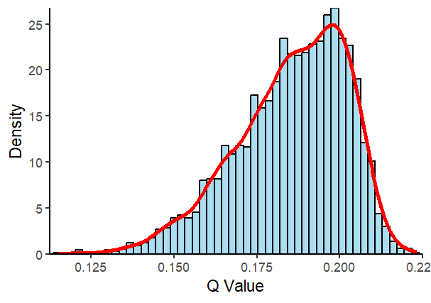
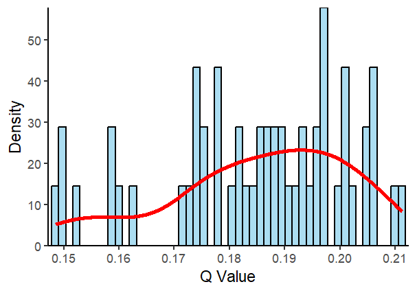

We demonstrate the necessity of the spatial explicit discretization (discretization with spatial soft constraints) method using the `Depression.csv` data from the `gdverse` package. In this analysis, we select `Depression_prevalence` as the dependent variable $Y$ and `PopulationDensity` as the independent variable $X$. $X$ is randomly shuffled, and the q-value is calculated using both discretization methods that do and do not account for spatial soft constraints, with the process repeated 10000 times. We selected hierarchical clustering with spatial soft constraints and hierarchical clustering without spatial soft constraints method to represent explicit and implicit spatial discretization, respectively. At the same time, natural breaks method and robust discretization are used as the control in this experiment. The hierarchical clustering with spatial soft constraints method and hierarchical clustering without spatial soft constraints method were implemented using the `ClustGeo` package, the natural breaks method is implemented based on the `sdsfun` package and the robust discretization is implemented by `gdverse` package. In subsequent analyses, all discretization methods applied will discretize the dataset into five strata for the calculation of the q-values.

### Install Necessary R Packages

```r
install.packages("gdverse",dep = TRUE)
# install.packages("devtools")
devtools::install_github("stscl/sesp",build_vignettes = TRUE,dep = TRUE)
```

### The spatial autocorrelation of the example data


``` r
dt = system.file('extdata/Depression.csv',package = 'gdverse') |>
  readr::read_csv() |>
  sf::st_as_sf(coords = c('X','Y'), crs = 4326) |>
  dplyr::select(y = Depression_prevelence,
                x = PopulationDensity)
## Rows: 1072 Columns: 13
## ── Column specification ────────────────────────────────────────────────────────────────────────────
## Delimiter: ","
## dbl (13): X, Y, Depression_prevelence, PopulationDensity, Population65, NoHealthInsurance, Neigh...
## 
## ℹ Use `spec()` to retrieve the full column specification for this data.
## ℹ Specify the column types or set `show_col_types = FALSE` to quiet this message.

sdsfun::moran_test(dt)
## ***                 global moran test
```


---------------------------------------------------------------------
 Variable     MoranI          EI         VarI       zI        pI     
---------- ------------- ------------ ----------- ------- -----------
    y       0.339557***   -0.0009337   0.0003192   19.06   2.892e-81 

    x       0.365364***   -0.0009337   0.0003192   20.5    1.052e-93 
---------------------------------------------------------------------


### Q values corresponding to spatial implicit discretization


``` r
geom = sf::st_geometry(dt)
y = dt$y
x = dt$x
gdist = stats::as.dist(sdsfun::sf_distance_matrix(dt))
hclustgeo_disc = \(xv,discnum,alpha = 0.5){
  D0 = stats::dist(xv)
  resh = ClustGeo::hclustgeo(D0,gdist,alpha = alpha)
  return(stats::cutree(resh,discnum))
}

x_naturaldisc = sdsfun::discretize_vector(x,5,method = "natural")
x_hclustdisc = hclustgeo_disc(x,5,alpha = 0)
x_robustdisc = gdverse::robust_disc(y ~ .,
                                 data = tibble::tibble(y = y,x = x),
                                 discnum = 5, cores = 1) |>
  dplyr::pull(1) |>
  as.factor() |>
  as.integer()
qv_naturaldisc = gdverse::factor_detector(y,x_naturaldisc)[[1]]
qv_naturaldisc
## [1] 0.07985365
qv_hclustdisc = gdverse::factor_detector(y,x_hclustdisc)[[1]]
qv_hclustdisc
## [1] 0.07315131
qv_robustdisc = gdverse::factor_detector(y,x_robustdisc)[[1]]
qv_robustdisc
## [1] 0.1199684
```

### A Monte Carlo simulation experiment demonstrating the necessity of spatial explicit discretization

In the repeated experiment, $X$ is shuffled 10000 times, and the global Moran's I of the original independent variable $X$ serves as the degree of spatial soft constraint (0.365 in this case). Subsequently, the q-values for each simulation round is computed.


``` r
mc_simq = \(times = 1000, cores = 6){
  doclust = FALSE
  if (inherits(cores, "cluster")) {
    doclust = TRUE
  } else if (cores > 1) {
    doclust = TRUE
    cores = parallel::makeCluster(cores)
    on.exit(parallel::stopCluster(cores), add = TRUE)
  }

  calcul_q = \(n_sim) {
    x_sim = sample(x)
    g = sdsfun::moran_test(
      sf::st_set_geometry(tibble::tibble(x_sim = x_sim),geom)
    )
    moran = dplyr::pull(g$result,2)
    moran_p = dplyr::pull(g$result,6)
    x_sed = hclustgeo_disc(x_sim, discnum = 5, alpha = 0.365)
    qv1 = gdverse::factor_detector(y,x_sed)[[1]]
    res = tibble::tibble(qv_sed = qv1, moran = moran,
                         moran_p = moran_p)
    return(res)
  }

  if (doclust) {
    parallel::clusterExport(cores,varlist = c("geom","y","x","gdist","hclustgeo_disc"))
    out_g = parallel::parLapply(cores,seq(1,times,by = 1),calcul_q)
    out_g = tibble::as_tibble(do.call(rbind, out_g))
  } else {
    out_g = purrr::map_dfr(seq(1,times,by = 1),calcul_q)
  }
  return(out_g)
}
```


``` r
qv = mc_simq(times = 10000, cores = 12)
qv
## # A tibble: 10,000 × 3
##    qv_sed     moran moran_p
##     <dbl>     <dbl>   <dbl>
##  1  0.198  0.0157     0.176
##  2  0.193 -0.000846   0.498
##  3  0.161  0.00929    0.284
##  4  0.194 -0.0183     0.835
##  5  0.199  0.0143     0.198
##  6  0.184  0.00340    0.404
##  7  0.210  0.00333    0.406
##  8  0.166 -0.0137     0.763
##  9  0.198 -0.0178     0.827
## 10  0.201 -0.0172     0.819
## # ℹ 9,990 more rows
```


``` r
ggplot2::ggplot(data = qv, ggplot2::aes(x = qv_sed)) +
  ggplot2::geom_histogram(ggplot2::aes(y = ggplot2::after_stat(density)),
                          bins = 50, fill = "skyblue",
                          color = "black", alpha = 0.7) +
  ggplot2::geom_density(color = "red", linewidth = 1.2) +
  ggplot2::scale_x_continuous(expand = c(0.01, 0)) +
  ggplot2::scale_y_continuous(expand = c(0, 0)) +
  ggplot2::labs(x = "Q Value",
                y = "Density") +
  ggplot2::theme_classic()
```



We selected simulated q-values that are more consistent with the actual situation, specifically those for which the global Moran's I of the permuted data is statistically significant (p-value < 0.05) and greater than zero.


``` r
qv_sign = dplyr::filter(qv,moran>=0&moran_p<=0.05)
qv_sign
## # A tibble: 552 × 3
##    qv_sed  moran   moran_p
##     <dbl>  <dbl>     <dbl>
##  1  0.171 0.0430 0.00695  
##  2  0.205 0.0395 0.0117   
##  3  0.187 0.0346 0.0234   
##  4  0.171 0.0553 0.000829 
##  5  0.191 0.0384 0.0139   
##  6  0.194 0.0346 0.0234   
##  7  0.200 0.0705 0.0000323
##  8  0.194 0.0344 0.0241   
##  9  0.197 0.0330 0.0289   
## 10  0.162 0.0328 0.0295   
## # ℹ 542 more rows
```


``` r
ggplot2::ggplot(data = qv_sign, ggplot2::aes(x = qv_sed)) +
  ggplot2::geom_histogram(ggplot2::aes(y = ggplot2::after_stat(density)),
                          bins = 50, fill = "skyblue",
                          color = "black", alpha = 0.7) +
  ggplot2::geom_density(color = "red", linewidth = 1.2) +
  ggplot2::scale_x_continuous(expand = c(0.01, 0)) +
  ggplot2::scale_y_continuous(expand = c(0, 0)) +
  ggplot2::labs(x = "Q Value",
                y = "Density") +
  ggplot2::theme_classic()
```



The q-value derived from classifying into five categories using the natural breaks method is 0.07985, while the q-value from five-category hierarchical clustering without spatial constraints is 0.07315. In comparison, the q-value obtained through robust discretization into five categories is 0.11997. In the Monte Carlo simulation experiment, the q-values range from 0.09198 to 0.23016. Among randomized simulations that best align with actual conditions, the q-value range spans from 0.10707 to 0.21871. These results indicate that spatially implicit discretization tends to underestimate the q-value of the variable under moderate spatial autocorrelation, highlighting the importance of spatially explicit discretization. The results also reveal that robust discretization, which accounts for the relationship between independent and dependent variables, can effectively reduce the q-value estimation bias introduced by spatially implicit discretization methods. However, it still underestimates the q-value by approximately -30.4262% to 47.8767%. This highlights the need for a spatially explicit discretization approach that fully considers the relationship between independent and dependent variables to more accurately capture the impact of spatial dependence on discretization.
